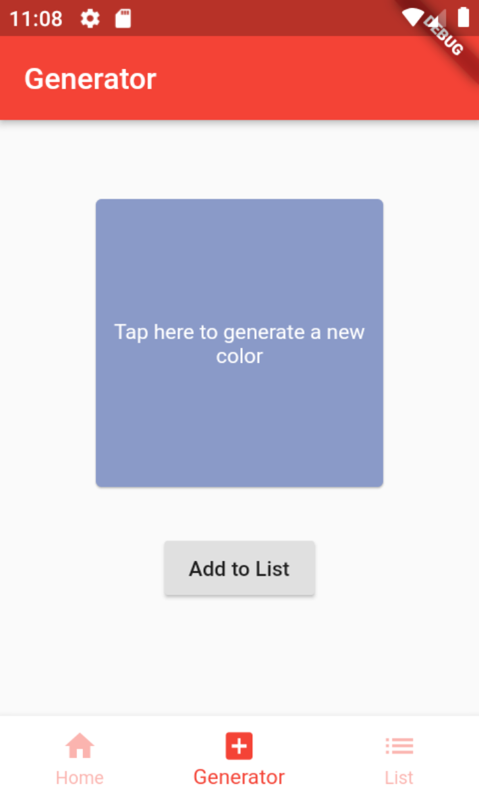

# Flutter BloC Demo

It's a small app to show how the BloC Pattern (and routing) is working. Initially made for following meetup groups:

- https://www.meetup.com/de-DE/GDG-BGL/
- https://www.meetup.com/de-DE/innovation-now/

